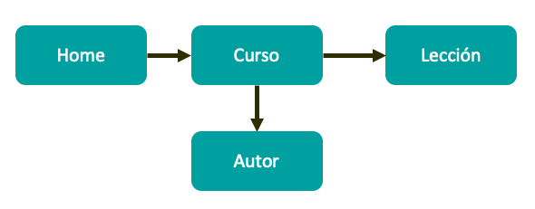

# MODELADO

## INTRODUCCIÓN

Este repositorio desarrolla el laboratorio del módulo 1 del Bootcamp Backend - Modelado. En el que se va a modelar la base de datos de un portal en el que se exponen videos técnicos, categorizado por temática, autor.

## OBJETIVOS

  - Realizar los diagramas del modelo de datos.
  - Realizar el Markdown con la explicaciónde por qué se ha realizado dicho modelado, patrones aplicados y razón.
  - Backup de una base de datos con datos de ejemplo.

## SITEMAP DE LA APP

## ENUNCIADO

A tener en cuenta:

- Va a ser un portal orientado al mundo de la programación.
- El portal va a estar compuesto por cursos, cada curso está compuesto a su vez por un número de videos y artículos que lo acompañen.
- La página de cursos debe mostrar la lista de autores que lo hicieron.
- La página de un video debe mostrar el autor que lo realizó.
- Los videos y el contenido de cada artículo se almacenan en un storage S3 y en un headless CMS, en la base de datos sólo almacenaremos los Id's a esos recursos.
- Los videos se pueden clasificar por temáticas (Devops / Front End / Back End / ...)
- Los videos tienen autores (ponemos la restricción, un video tiene un autor), un curso puede tener varios autores.
- En principio los vídeos no se van a compartir entre diferentes cursos (aunque sería una amplicacíon interesante del ejercicio.
- Hay una opción para ver la página con la biografía del autor, esta página no va a ser muy visitada.
- Restricción, un vídeo tiene un autor.

## CARGA DE LA APLICACIÓN

- Inicialmente srán 10 cursos, se espera que alcancen 100 en un año y máximo 1000 e n cinco años.
- Un curso tendrá entre 1-20 vídeos máximos.

## RENDIMIENTO/CONSULTAS

- Debe mostrar los últimos 5 vídeos de cada categoría (frontend, backend y devops), aquí se puede delegar en el servidor web que cacheé está página.
- La página en la que se muestra el detalle de un curso se va a visualizar a menudo.
- Es crítico que la búsqueda sea rápida.
- La página en la que se va a visualizar un vídeo de un curso se verá a menudo.
- La página del autor se espera que no se consuma tan a menudo.
- Hay una opción para ver la página con la biografía del autor, esta página no va a ser muy visitada.

## R/W Y LATENCIA

- Escritura:
  - Se espera que no se suba más de uno o dos cursos/vídeos al día.
  - Se espera que un autor se cree como mucho una vez al día.

- Lectura:
  - Se espera una carga fuerte de lectura en la página principal, lecciones y vídeos.

## OTRAS CARACTERÍSTICAS

-Ficha de cursos: 
  - El texto de descripción del curso estará almacenado como recurso externo a la base de datos, Mongo sólo almacenará un GUID que identifique a ese contenido.
  - Los vídeos en si se almacenan en una CDN, la base de datos solo necesita saber el GUID del vídeo o el url.

## LISTA DE ENTIDADES

- Cursos
- Autores
- Vídeos
- Artículos
